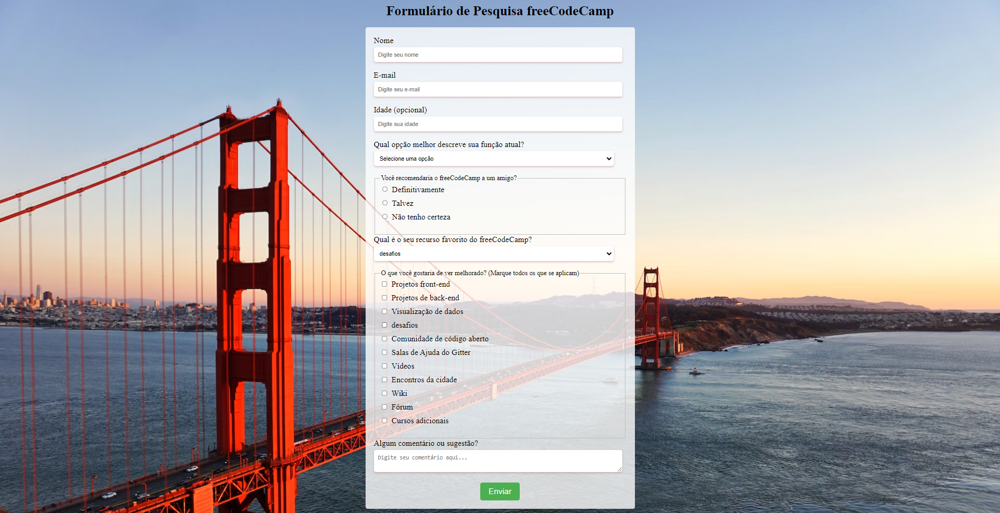

<h2>Histórias de Usuários</h2>
<h3>Formulario-pesquisa</h3>

<h4>- Você deve ter um elemento h1 com um id "title".</h4>
<h4>- Você deve ter um elemento p com um id "description".</h4>
<h4>- Você deve ter um elemento form com um id "survey-form".</h4>
<h4>- Dentro do elemento de formulário, você deve ter um campo de input para o nome com um id "name" e o atributo type definido como "text".</h4>
<h4>- Dentro do elemento de formulário, você deve ter um campo de input para o e-mail com um id "email".</h4>
<h4>- Se você inserir um e-mail que não esteja formatado corretamente, verá um erro de validação HTML5.</h4>
<h4>- Dentro do formulário, você pode inserir um número em um campo de input com o id "number".</h4>
<h4>- A entrada numérica não deve aceitar não-números, impedindo que você os digite ou exibindo um erro de validação HTML5 (dependendo do seu navegador).</h4>
<h4>- Se você inserir números fora do intervalo definido pelos atributos min e max, você verá um erro de validação HTML5.</h4>
<h4>- Para os campos de entrada de nome, e-mail e número, você pode ver os elementos label correspondentes no formulário, que descrevem a finalidade de cada campo com os seguintes IDs: "name-label", "email-label" e "number-label".</h4>
<h4>- Para os campos de entrada de nome, e-mail e número, você pode ver o texto do espaço reservado que fornece uma descrição ou instruções para cada campo.</h4>
<h4>- Dentro do elemento de formulário, você deve ter um elemento select com o id "dropdown" e pelo menos duas opções para escolher.</h4>
<h4>- Dentro do elemento de formulário, você pode selecionar uma opção de um grupo de pelo menos dois botões de opção agrupados usando o atributo name.</h4>
<h4>- Dentro do elemento de formulário, você pode selecionar várias opções em uma série de caixas de seleção, cada uma delas deve ter um atributo value.</h4>
<h4>- Dentro do elemento de formulário, você verá um elemento textarea para comentários adicionais.</h4>
<h4> Dentro do elemento de formulário, você verá um botão com o id "submit" para enviar todas as entradas.</h4>

<h2>## Testes</h2>

<h4>Esperando: Você deve ter um elemento h1 com o id "title".</h4>
<h4>Esperando: O elemento h1 com o id "title" não deve estar vazio.</h4>
<h4>Esperando: Você deve ter um elemento p com o id "description".</h4>
<h4>Esperando: O elemento p com o id "description" não deve estar vazio.</h4>
<h4>Esperando: Você deve ter um elemento form com o id "survey-form".</h4>
<h4>Esperando: Você deve ter um elemento input com o id "name".</h4>
<h4>Esperando: O campo de input com o id "name" deve ter o atributo type definido como "text".</h4>
<h4>Esperando: O campo de input com o id "name" deve exigir entrada.</h4>
<h4>Esperando: O campo de input com o id "name" deve ser descendente de #survey-form.</h4>
<h4>Esperando: Você deve ter um elemento input com o id "email".</h4>
<h4>Esperando: O campo de input com o id "email" deve ter o atributo type definido como "email".</h4>
<h4>Esperando: O campo de input com o id "email" deve exigir entrada.</h4>
<h4>Esperando: O campo de input com o id "email" deve ser descendente de #survey-form.</h4>
<h4>Esperando: Você deve ter um elemento input com o id "number".</h4>
<h4>Esperando: O campo de input com o id "number" deve ser descendente de #survey-form.</h4>
<h4>Esperando: O campo de input com o id "number" deve ter o atributo type definido como "number".</h4>
<h4>Esperando: O campo de input com o id "number" deve ter o atributo min com um valor numérico.</h4>
<h4>Esperando: O campo de input com o id "number" deve ter o atributo max com um valor numérico.</h4>
<h4>Esperando: Você deve ter um elemento label com o id "name-label".</h4>
<h4>Esperando: Você deve ter um elemento label com o id "email-label".</h4>
<h4>Esperando: Você deve ter um elemento label com o id "number-label".</h4>
<h4>Esperando: O elemento label com o id "name-label" deve conter um texto que descreva a entrada.</h4>
<h4>Esperando: O elemento label com o id "email-label" deve conter um texto que descreva a entrada.</h4>
<h4>Esperando: O elemento label com o id "number-label" deve conter um texto que descreva a entrada.</h4>
<h4>Esperando: O elemento label com o id "name-label" deve ser descendente de #survey-form.</h4>
<h4>Esperando: O elemento label com o id "email-label" deve ser descendente de #survey-form.</h4>
<h4>Esperando: O elemento label com o id "number-label" deve ser descendente de #survey-form.</h4>
<h4>Esperando: O campo de input com o id "name" deve ter o atributo placeholder com um valor.</h4>
<h4>Esperando: O campo de input com o id "email" deve ter o atributo placeholder com um valor.</h4>
<h4>Esperando: O campo de input com o id "number" deve ter o atributo placeholder com um valor.</h4>
<h4>Esperando: Você deve ter um elemento select com o id "dropdown".</h4>
<h4>Esperando: O elemento select com o id "dropdown" deve ter pelo menos duas opções selecionáveis (não desabilitadas).</h4>
<h4>Esperando: O elemento select com o id "dropdown" deve ser descendente de #survey-form.</h4>
<h4>Esperando: Você deve ter pelo menos dois elementos input com o atributo type definido como "radio" (botões de opção).</h4>
<h4>Esperando: Você deve ter pelo menos dois botões de opção descendentes de #survey-form.</h4>
<h4>Esperando: Todos os botões de opção devem ter o atributo value com um valor.</h4>
<h4>Esperando: Todos os botões de opção devem ter o atributo name com um valor.</h4>
<h4>Esperando: Cada grupo de botões de opção deve ter pelo menos 2 botões de opção.</h4>
<h4>Esperando: Você deve ter pelo menos dois elementos input com o atributo type definido como "checkbox" (caixas de seleção) que sejam descendentes de #survey-form.</h4>
<h4>Esperando: Todas as caixas de seleção de #survey-form devem ter o atributo value com um valor.</h4>
<h4>Esperando: Você deve ter pelo menos um elemento textarea descendente de #survey-form.</h4>
<h4>Esperando: Você deve ter um elemento input ou button com o id "submit".</h4>
<h4>Esperando: O elemento com o id "submit" deve ter o atributo type definido como "submit".</h4>
<h4>Esperando: O elemento com o id "submit" deve ser descendente de #survey-form.</h4>
